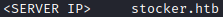

# Stocker
Try this box by JoshSH at https://app.hackthebox.com/machines/523

before you start make sure to add the following to your /etc/hosts file 

## Nmap Scan
start with checking if there are any ports open on the host 
nmap -sS -sV -sC -vv stocker.htb

ports 22 (ssh) and 80 (http) are standard ports that are (usually) always open on servers so this scan didn't really give us any information, lets keep going with discovery
## Subdomain Enumeration
lets try to find some hidden subdomains, we can do this by using the ffuf tool with a wordlist.  
ffuf -w /usr/share/seclists/Discovery/DNS/subdomains-top1million-5000.txt -u http://FUZZ.stocker.htb

This seems to have found a subdomain called dev, lets add that to the /etc/hosts file and see what is on the web page

## Login page

this dev subdomain seems to have redirected us to a login page of some sort, lets try the credentials admin:admin to see if we can get easy access.

so that didn't work, lets check out the request in burp to see if there is any information that is not given to us through our browser.

nothing really interesting here either. after having a look around the internet for common authentication bypasses we found this one at https://book.hacktricks.xyz/pentesting-web/nosql-injection#basic-authentication-bypass. if we use burp repeater to change the login parameters into this json code, we may be able to get past the authentication page (dont forget to change the Content-Type header to application/json)

{"username": {"$ne": null}, "password": {"$ne": null} }

the request says it is redirecting us to a /stock page, lets check it out in the browser

looks like a store of some kind, lets add something to the cart and checkout with it so we can see the store workflow.

adding something to the cart brings up a popup letting us know it has been added to the basket:

view cart shows us what is in our basket:

and submit purchase thanks us for our purchase:

if we click on the hyperlink it shows us our purchase order at some kind of api endpoint as a pdf:

now that we have successfully ordered something, lets check out the ordering workflow on burp, when we order something by clicking the submit purchase button, it sends an order to the order api endpoint in json. we can actually see that the "title" value in the json is reflected in the pdf, and the "orderId" value in the response is reflected in the url:

This could potentially be a location that we can include local files.

## Local File Include

Lets use burp repeater to change the json "title" value to an iframe to see if we can get the pdf to reflect the /etc/passwd/ file
"title": "<iframe src=file:///etc/passwd height:750px width: 750px></iframe>"

Awesome, we have successfully found a local file include vulnerability and found a user called angoose that we can potentially ssh into, but first we need to find the password. lets use wappalyzer to identify what technologies the server is build on and hopefully find some common files associated with them.

Wappalyzer indentified that the endpoing is built on Node.js, and a file that is usually included with the node.js package is index.js, so lets try to include that file in the same way we did with the /etc/passwd file
"title": "<iframe src=file:///var/www/dev/index.js height:750px width: 750px></iframe>"

we can see that one of the lines of the index.js file connects to a mongodb, and has a password shown in plaintext. lets try to ssh into the server using the credentials gained:  angoose:IHeardPassphasesArePrettySecure

## Privilege Escalation

since we already have a password for angoose, lets check out what sudo permissions this account has

looks like this account has permissions to run .js scripts as root as long as we indicate the file path /usr/local/scripts/

lets define a .js script that spawns a bash shell with root permissions, and execute it using directory traversal:
const fs = require("child_process").spawn("/usr/bin/bash", {stdio:[0, 1, 2]})
